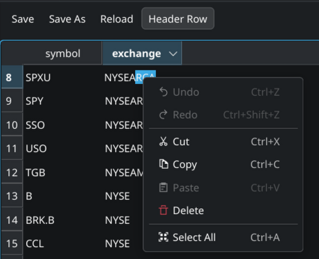
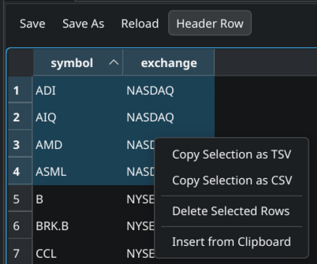

# CSV/TSV Table Grid Lister Plugin for Double Commander (Linux/Wayland)

A WLX (Lister) plugin for Double Commander built with Qt6 to visualize, navigate, edit, and export **CSV** and **TSV** files in a clean, interactive spreadsheet-like grid (`QTableWidget`).

This plugin is a Qt port of the original work by **j2969719**. You can find the original author's repository at [https://github.com/j2969719/doublecmd-plugins](https://github.com/j2969719/doublecmd-plugins).

---

## Screenshots

### Toolbar and Header Row Toggle


### Custom Right-Click Context Menu


---

## Features

- **Spreadsheet Grid View**: Displays CSV/TSV data in an organized grid table (`QTableWidget`) with adjustable row and column headers.
- **Double-Quote Parsing**: Correctly handles double-quoted fields containing commas, tabs, or newlines, conforming to standard CSV RFC behaviors.
- **Encoding Auto-Detection**: Utilizes **Enca** (`libenca`) to automatically detect file character set encodings (such as Cyrillic, UTF-8, Latin, etc.) and converts it gracefully with Glib fallbacks.
- **Inline Editing**: Modify cell contents directly inside Lister by double-clicking any cell.

---

### Header Row Toggle

A checkable **Header Row** button is shown in the toolbar (enabled by default).

- **On (default)**: The first line of the file is treated as column headers. It is displayed in the table header row (not as a data row). Sort arrows appear on the header. Copy operations include the header line.
- **Off**: The first line is treated as a regular data row and appears at index 0. Columns display default numeric labels. Copy operations do not include a header line.

Toggling this button automatically reloads and re-parses the file.

---

### Copying

- Press **`Ctrl+C`** to copy the currently selected cells as **TSV** (Tab Separated Values) to the clipboard.
- Right-click to open the context menu and choose **Copy Selection as TSV** or **Copy Selection as CSV**.

**Header inclusion rules:**
- If **Header Row** is **on**: the column headers of the selected columns are prepended as the first line of the copied text.
- If **Header Row** is **off**: only the selected cell values are copied, with no header line.

---

### Pasting (Row Insertion)

- Press **`Ctrl+V`** (or right-click → **Insert from Clipboard**) to insert rows from the clipboard.
- The clipboard content must be tab-separated (TSV) or match the file's separator, and the **number of columns must match** exactly — otherwise the paste is silently ignored.
- Rows are inserted **at the selected row**, pushing the selected row and everything below it down.
- If no row is selected, rows are appended at the end.
- **Header deduplication**: If **Header Row** is **on** and the first line of the clipboard exactly matches the current column headers, that line is automatically skipped — only the data rows below it are inserted. This means you can copy a selection that includes the header and paste it back without duplicating the header.

---

### Deleting Rows

- Press **`Delete`** (or right-click → **Delete Selected Rows**) to remove all selected rows from the grid.
- Multiple non-contiguous rows can be selected and deleted in one operation.

---

### Save & Reload

- **`Ctrl+S`** or click **Save** to save all changes back to the original file. Works correctly whether or not a cell is being edited — if a cell editor is active it is committed first; otherwise the file is saved directly without disturbing Double Commander's focus.
- **Save As...** to export to a different file path or format.
- **Reload** to discard unsaved changes and re-read the file from disk.

---

### Search

Press **`F7`** (or use Lister's built-in search) to search for substrings across all cells.

---

### TSV Support

Works with both `.csv` and `.tsv` files. The separator is auto-detected from content (trying `,`, `;`, `\t` in order). If auto-detection is ambiguous, the file extension is used as a fallback: `.tsv` → tab, `.csv` → comma.

---

## Installation

1. Switch to the `csvview` branch and run `./build.sh` to compile the plugin.
2. The binary `csvview_qt6.wlx` will be built under `release/wlx/csvview/`.
3. In Double Commander, open **Options** → **Plugins** → **WLX**.
4. Click **Add** and select `/path/to/csvview_qt6.wlx`.
5. Ensure the detect string is configured as:
   ```
   (EXT="CSV" | EXT="TSV") & SIZE<30000000
   ```

---

## Configuration

The plugin configuration is stored in `j2969719.ini` inside the Double Commander settings directory. Edit settings under the `[csvview_qt6.wlx]` section:

| Key | Type | Description |
|---|---|---|
| `enca` | bool | Enable Enca character encoding auto-detection |
| `resize_columns` | bool | Auto-resize column widths to fit contents |
| `enca_readall` | bool | Read the entire file for encoding detection (slower but more accurate) |
| `doublequoted` | bool | Handle RFC-compliant double-quoted CSV fields |
| `draw_grid` | bool | Draw grid lines between cells |
| `enca_lang` | string | Locale hint for Enca (e.g. `ru`, `cs`) |
