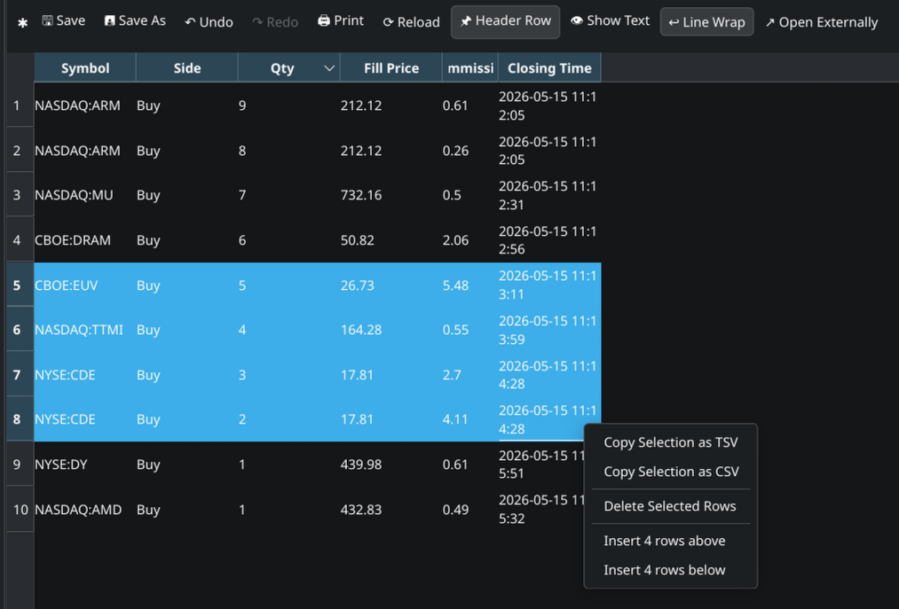
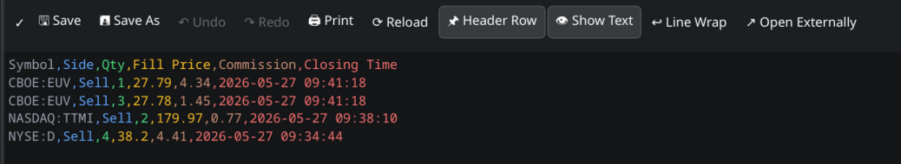

# CSV/TSV Table Grid Lister Plugin for Double Commander (Linux/Wayland)

A WLX (Lister) plugin for Double Commander built with Qt6 to visualize, navigate, edit, and export **CSV** and **TSV** files in a clean, interactive spreadsheet-like grid (`QTableWidget`).

This plugin is a Qt port of the original work by **j2969719**. You can find the original author's repository at [https://github.com/j2969719/doublecmd-plugins](https://github.com/j2969719/doublecmd-plugins).

---

## Screenshots

### Toolbar and Header Row Toggle


### Custom Right-Click Context Menu


---

## Features

- **Spreadsheet Grid View**: Displays CSV/TSV data in an organized grid table (`QTableWidget`) with adjustable row and column headers.
- **Double-Quote Parsing**: Correctly handles double-quoted fields containing commas, tabs, or newlines, conforming to standard CSV RFC behaviors.
- **Encoding Auto-Detection**: Automatically detects file character set encodings (such as Cyrillic, UTF-8, Latin, etc.) using an embedded encoding engine.
- **Inline Editing**: Modify cell contents directly inside Lister by double-clicking any cell.
- **Undo / Redo Support**: Full edit history (`Ctrl+Z` / `Ctrl+Y`) for cell editing, row/column operations, reordering, and sorting.
- **Interactive Column Drag-and-Drop**: Rearrange columns by dragging and dropping headers, with full support for undoing and redoing the rearrangement.
- **Column Context Menu**: Right-click headers to copy, paste, insert empty columns, or delete column selections.
- **Row Insertion Options**: Insert empty rows or clipboard content above or below the current selection.
- **Text / Source View Mode**: Switch between the spreadsheet grid and a raw text preview with word wrap.
- **Open Externally**: Launch the file in the system's default external application directly from the toolbar.
- **Smart Focus Management**: Seamlessly yields keyboard and mouse focus to Double Commander when clicking outside the plugin, ensuring file selection changes and arrow-key pane navigation work flawlessly.

---

### Header Row Toggle

A checkable **Header Row** button is shown in the toolbar (enabled by default).

- **On (default)**: The first line of the file is treated as column headers. It is displayed in the table header row (not as a data row). Sort arrows appear on the header. Copy operations include the header line.
- **Off**: The first line is treated as a regular data row and appears at index 0. Columns display default numeric labels. Copy operations do not include a header line.

Toggling this button automatically reloads and re-parses the file.

---

### Copying

- Press **`Ctrl+C`** to copy the currently selected cells as **TSV** (Tab Separated Values) to the clipboard.
- Right-click to open the context menu and choose **Copy Selection as TSV** or **Copy Selection as CSV**.

**Header inclusion rules:**
- If **Header Row** is **on**: the column headers of the selected columns are prepended as the first line of the copied text.
- If **Header Row** is **off**: only the selected cell values are copied, with no header line.

---

### Pasting & Row Insertion

- **Insert Empty Row**: Right-click → **Insert Empty Row Above** or **Insert Empty Row Below** to add a blank row.
- **Insert Clipboard Rows**: Press **`Ctrl+V`** (or right-click → **Insert Row from Clipboard Above** or **Insert Row from Clipboard Below**) to insert rows from the clipboard.
- The clipboard content must be tab-separated (TSV) or match the file's separator, and the **number of columns must match** exactly — otherwise the paste is silently ignored.
- **Header deduplication**: If **Header Row** is **on** and the first line of the clipboard exactly matches the current column headers, that line is automatically skipped — only the data rows below it are inserted.

---

### Deleting Rows

- Press **`Delete`** (or right-click → **Delete Selected Rows**) to remove all selected rows from the grid.
- Multiple non-contiguous rows can be selected and deleted in one operation.

---

### Undo & Redo

- Press **`Ctrl+Z`** to undo the last edit, insertion, deletion, sorting, or column move.
- Press **`Ctrl+Y`** (or **`Ctrl+Shift+Z`**) to redo an undone action.
- A **dirty indicator** (`✓` / `●`) on the toolbar shows whether there are unsaved edits in the undo history.

---

### Column Manipulation & Sorting

- **Drag-and-Drop Reordering**: Drag any column header horizontally to reorder columns in the grid.
- **Sorting**: Click any column header to sort the table data by that column. Click again to toggle between ascending and descending order.
- **Column Context Menu**: Right-click a column header to access column-specific options:
  - Copy column selection.
  - Paste column selection.
  - Insert empty columns.
  - Delete selected columns.

---

### Source Text Mode & External Apps

- **Toggle Text Mode**: Click the **Text Mode** button to view the raw, unparsed text content of the file. Toggle **Word Wrap** to wrap lines.
- **Open Externally**: Click the **Open Externally** button to open the file in the default system editor/application.

---

### Save & Reload

- **`Ctrl+S`** or click **Save** to save all changes back to the original file. Works correctly whether or not a cell is being edited — if a cell editor is active it is committed first; otherwise the file is saved directly without disturbing Double Commander's focus.
- **Save As...** to export to a different file path or format.
- **Reload** to discard unsaved changes and re-read the file from disk.

---

### Find & Replace

Press **`Ctrl+F`** (to find), **`Ctrl+R`** (to replace), or click the **`🔍 Find/Replace`** toolbar button to open the inline Find/Replace panel at the bottom of the table grid view. Hitting **`Escape`** closes it.

* **Search Options**:
  - **Match Case**: Performs a case-sensitive search.
  - **Match Entire Cell**: Only matches cells that are an exact match for the query.
  - **Regular Expression**: Uses standard regex patterns for searching and replacing.
* **Scope Options**:
  - **All Cells**: Searches and replaces across the entire spreadsheet grid.
  - **Selected Cells**: Limits the search/replace to the currently highlighted cells.
  - **Current Column**: Restricts operations to the column of the active cell.
  - **Current Row**: Restricts operations to the row of the active cell.
* **Action Buttons**:
  - **Find Next** (or hitting **`Enter`** in the Find input): Highlights and scrolls to the next matching cell.
  - **Find Prev**: Highlights and scrolls to the previous matching cell.
  - **Replace** (or hitting **`Enter`** in the Replace input): Replaces the text of the current match and automatically advances to the next.
  - **Replace All**: Evaluates all cells inside the selected scope and applies replacements atomically in a single undo macro.
* **Automatic Quoting Safeguard**:
  - If a replacement introduces the separator character (e.g. inserting `,` in a CSV or `\t` in a TSV), the plugin automatically wraps the cell value in double quotes and escapes existing quotes correctly in the raw text mode and on file save. This metadata change is fully integrated into the Undo/Redo stack.

---

### Classic Lister Search

Press **`F7`** (or use Double Commander's built-in search) to search for substrings across all cells using the classic dialog.

---

### TSV Support

Works with both `.csv` and `.tsv` files. The separator is auto-detected from content (trying `,`, `;`, `\t` in order). If auto-detection is ambiguous, the file extension is used as a fallback: `.tsv` → tab, `.csv` → comma.

---

## Installation

1. Switch to the `csvview` branch and run `./build.sh` to compile the plugin.
2. The binary `csvview_qt6.wlx` will be built under `release/wlx/csvview/`.
3. In Double Commander, open **Options** → **Plugins** → **WLX**.
4. Click **Add** and select `/path/to/csvview_qt6.wlx`.
5. Ensure the detect string is configured as:
   ```
   (EXT="CSV" | EXT="TSV") & SIZE<30000000
   ```

---

## Configuration

The plugin configuration is stored in `j2969719.ini` inside the Double Commander settings directory. Edit settings under the `[csvview_qt6.wlx]` section:

| Key | Type | Description |
|---|---|---|
| `enca` | bool | Enable Enca character encoding auto-detection |
| `resize_columns` | bool | Auto-resize column widths to fit contents |
| `enca_readall` | bool | Read the entire file for encoding detection (slower but more accurate) |
| `doublequoted` | bool | Handle RFC-compliant double-quoted CSV fields |
| `draw_grid` | bool | Draw grid lines between cells |
| `enca_lang` | string | Locale hint for Enca (e.g. `ru`, `cs`) |
