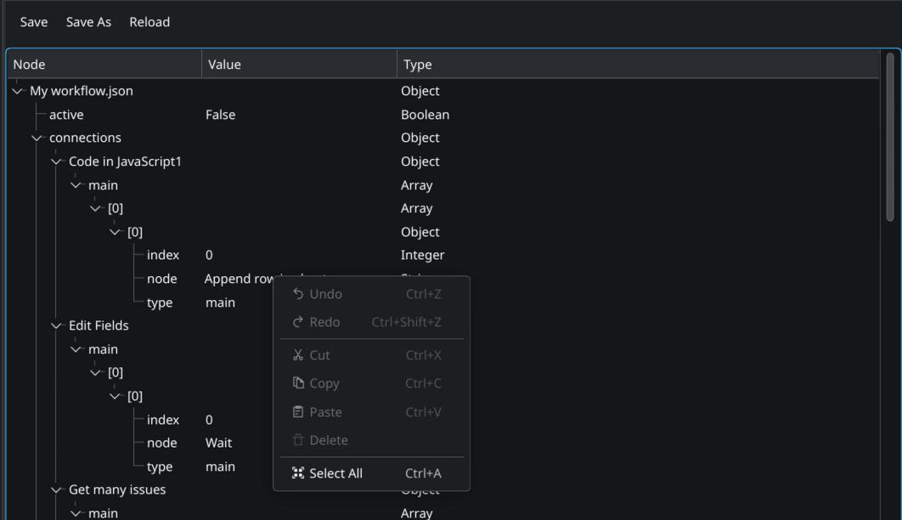
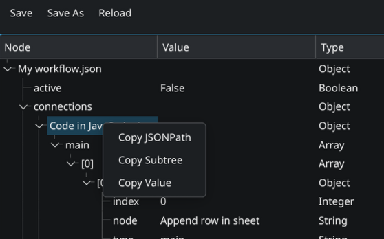

# JSON Tree Viewer Lister Plugin for Double Commander (Linux/Wayland)

A WLX (Lister) plugin for Double Commander built with Qt6 to visualize, navigate, edit, and export **JSON** (`.json`) files using an interactive, hierarchical Tree view.

This plugin is a Qt port of the original work by **j2969719**. You can find the original author's repository at [https://github.com/j2969719/doublecmd-plugins](https://github.com/j2969719/doublecmd-plugins).

---

## Screenshots

### JSON Tree Representation


### Expanded Structure & Values


---

## Features

- **Interactive Tree Hierarchy**: Visualizes nested JSON objects and arrays in a structured, collapsible tree (`QTreeWidget`).
- **Data Columns**:
  - **Node**: Keys/labels of objects or indices of arrays.
  - **Value**: Element values (strings, numbers, booleans, null).
  - **Type**: Automatically shows the data type (Object, Array, String, Integer, Double, Boolean, Null).
- **Inline Editing**: Double-click on any value field (Column 1) to edit the JSON data directly within Lister.
- **Saving Changes**:
  - `Ctrl+S` or click **Save** to overwrite the file.
  - **Save As...** to save the modified JSON to a new path.
- **Search Support**: Press `F7` (or native Lister search) to search for specific text within node keys, values, and types. Supports case sensitivity.
- **Right-Click Context Menu Actions**:
  - **Copy JSONPath**: Copy the dotted path to the selected node (e.g. `store.book[0].title`) directly to the clipboard.
  - **Copy Subtree**: Rasterize/serialize the selected subtree back to indented JSON text format and copy it to the clipboard.
  - **Copy Key:Value**: Copy the key and value pair to the clipboard.
  - **Copy Value**: Copy the exact value of the selected node to the clipboard.

---

## Installation

1. Switch to the `jsonview` branch and run `./build.sh` to compile the plugin.
2. The binary `jsonview_qt6.wlx` will be built under `release/wlx/jsonview/`.
3. In Double Commander, open **Options** -> **Plugins** -> **WLX**.
4. Click **Add** and select `/path/to/jsonview_qt6.wlx`.
5. Double Commander will register the extension string. Ensure the detect string is configured as:
   ```
   (EXT="JSON") & SIZE<30000000
   ```

---

## Configuration

The plugin configuration is stored in `j2969719.ini` inside the Double Commander settings directory. You can edit settings under the `[jsonview]` section:
- `resize_columns` (boolean): Automatically resize column widths to fit content.
- `tree_expand` (boolean): Expand all tree nodes on load.
- `column_width` (integer): Default width of columns if auto-resize is off.
- `sorting` (boolean): Enable alphabetical sorting of object keys.
- `show_filename` (boolean): Show the filename as the root node, or default to "Root".
