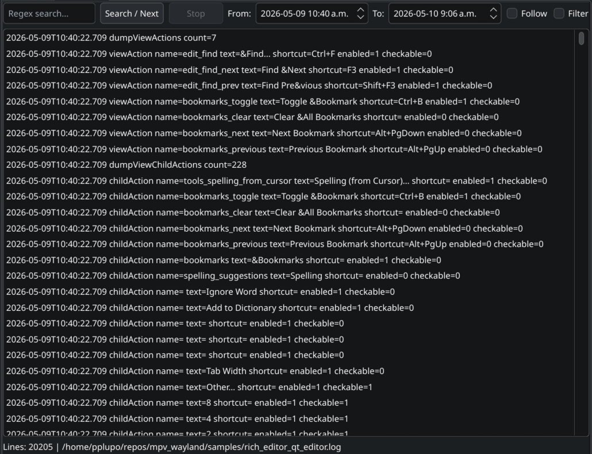

# WLX Log Viewer Plugin for Double Commander

A high-performance, Wayland-compatible WLX (Lister) log viewer plugin for Double Commander, built with Qt6 and C++20. Designed specifically to handle large log files seamlessly while providing fast searching and filtering capabilities without freezing the host application.



## Features

- **Zero-Copy File Loading**: Utilizes `mmap` and line-offset indexing to instantly load massive log files with extremely low memory overhead.
- **Fast Regex Searching**: Powered by Google's `RE2` regex engine. Searches are offloaded to a background `std::jthread` to keep the UI fully responsive.
- **Timestamp Range Filtering**: Automatically detects and parses common timestamp formats (ISO 8601, nginx, syslog). Allows filtering log lines within a specific date/time range.
- **Live Tailing (Follow Mode)**: Monitors the file for changes using `QFileSystemWatcher` (inotify-based) and automatically updates and scrolls to new entries.
- **Advanced Filtering**: Implements `QSortFilterProxyModel` for combining regex matches and timestamp ranges efficiently.
- **Native Interactions**: Supports standard file manager interactions, including multi-row selection (Ctrl+click, Shift+click) and copying (Ctrl+C, Right-click context menu).
- **Wayland Focus Isolation**: Implements a robust 4-layer focus defense architecture to resolve Wayland focus-hijacking bugs typical when embedding Qt components into Lazarus applications:
  - **Layer 0**: Deferred `show()` execution to prevent the plugin from trapping the host's `MouseRelease` event (fixes the "phantom-drag" issue).
  - **Layer 1**: Aggressive `Qt::NoFocus` policy applied to the base container.
  - **Layer 2**: Recursive focus guard that strips focus capabilities from all non-input child widgets.
  - **Layer 3**: Cross-load focus preservation (saves the currently focused Double Commander widget state and restores it after loading completes).
  - **Layer 4**: Global `FocusIn` event interceptor that immediately yanks stolen focus back to Double Commander, unless an input field is explicitly clicked by the user.

## Dependencies

To build this plugin, the following packages and libraries are required:

- **C++20** compatible compiler (GCC or Clang)
- **CMake** (3.16 or higher)
- **Qt 6** development packages (Core, Gui, Widgets)
- **RE2** regular expression library (`libre2-dev` on Debian/Ubuntu)

## Build Instructions

1. Clone or navigate to the plugin directory.
2. Create a build directory and configure with CMake:
   ```bash
   mkdir build
   cd build
   cmake ..
   ```
3. Compile the plugin:
   ```bash
   make -j$(nproc)
   ```
4. Install the compiled `.wlx` file to your Double Commander WLX plugins directory:
   ```bash
   cp logviewer_wlx.wlx ~/.config/doublecmd/plugins/wlx/
   ```

## Installation in Double Commander

1. Open Double Commander.
2. Go to **Configuration** > **Options** > **Plugins** > **WLX (Lister)**.
3. Click **Add** and select the installed `logviewer_wlx.wlx` file.
4. The plugin automatically registers the following extensions: `.log`, `.out`, `.err`, `.ndjson`, `.jsonl`, `.1`, `.2`, and `.old`. You can adjust this "Detect string" in Double Commander's options if you want it to automatically trigger on other extensions.
5. Apply and close. Select a log file and press `F3` or `Ctrl+Q` (Quick View) to use. For files without an extension (like `/var/log/syslog`), select the file and press `F3`.
